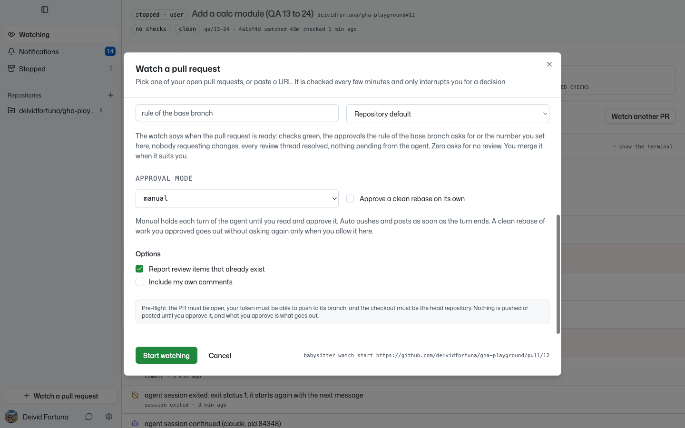

# 23. A message typed right after the opening message reaches the agent cut

**Pending issue 23 of `PENDING_ISSUES.md`.** The page carries the number
of the issue.

**Verdict: seen once in the app. No test yet.**

Evidence collected 2026-09-23, branch `test-battery` at `c4c0666`, watch
1 on `deividfortuna/gha-playground#11`, found during the evidence run of
issues 13 to 22.

## What I did

The daemon started again after a stop, with no conversation to
continue. A review comment of `4c3b0l7` was waiting. The first poll
started a new session and typed two messages.

## What I saw

The daemon typed the second message 0.35 seconds after the first:

```
18:10:06.480 agent session started (claude, pid 55850)
18:10:07.341 told the agent about the pull request
18:10:07.692 told the agent about 1 comment
```

The agent got the end of the second message only:

```
claude: Your message came through as just "ground/pull/11". That looks like the end
of a PR link, with no event in it.
```

The comment reached the agent only when I told it myself. The daemon
marked it told, so a poll never sends it again.

## What to look at

`deliverRoutine` blocks only while the agent asks the author something.
It types into a session that is busy with the opening message, and the
text lands while Claude Code draws its first turn.

## QA check

**Verdict: not reproduced in two tries, one of them with the same gap
as the first run. Nothing changed in the code. It stays open, and no
test fails for it.**

Checked 2026-09-23 at `13f6bfc`, with Claude Code 2.1.280 on
`deividfortuna/gha-playground#12`.

### A new watch that reports the review items that exist

In the app, I started watch 2 with `Report review items that already
exist`:



The daemon typed the opening message and the message about four
review comments 1.37 seconds apart, while the agent was busy with its
first turn:

```
19:32:52.580 agent session started (claude, pid 84749)
19:32:53.534 told the agent about the pull request
19:32:54.904 told the agent about 4 comments
```

The agent read all four comments and answered each one.

### A restart with a comment waiting

The agent runs with `Transcript saving is off`, so a restart of the
daemon has no conversation to continue, as in the first run. I stopped
the daemon, the reviewer commented, and I started the daemon again:

```
19:34:18.979 agent session continued (claude, pid 85666)
19:34:19.349 agent session exited: exit status 1; it starts again with the next message
19:34:24.190 agent session started (claude, pid 85714)
19:34:25.047 told the agent about the pull request
19:34:25.410 told the agent about 1 comment
```

The gap was 0.363 seconds, the gap of the first run. The agent got the
whole message:

```
you: The following 1 unresolved review comment is on PR #12 (qa/13-24 -> main). ...
1. calc.js:9 (@4c3b0l7), comment id 4080067524:
```

It committed `5110b26` and recorded its reply.

### What stays true

`deliverRoutine` still types a routine message into a session that is
busy with its opening turn. Whether Claude Code keeps the text depends
on what its screen does at that moment, which a unit test of the daemon
cannot reach. A fake agent reads each key it gets, so it cannot show the
cut either.

## Regression check after the rebase

**Verdict: not reproduced, a third time, with the gap of the first
run.**

Checked 2026-09-24 at `3c87078`, after the rebase of `test-battery`,
with Claude Code 2.1.280 on `deividfortuna/gha-playground#13`. I stopped
the daemon, the reviewer commented on `calc.js:14`, and I started the
daemon again with `claude` as the agent. The session of the fake agent
could not continue, so the daemon started a new one:

```
07:19:08.690 agent session continued (claude, pid 87688)
07:19:09.086 agent session exited: exit status 1; it starts again with the next message
07:19:13.894 agent session started (claude, pid 87732)
07:19:14.745 told the agent about the pull request
07:19:15.095 told the agent about 1 comment
```

The gap was 0.350 seconds. The terminal of the agent shows both
messages whole:

```
you: You are babysitting PR #13 (regress/rebase -> main) of deividfortuna/gha-playground.
you: The following 1 unresolved review comment is on PR #13 (regress/rebase -> main). ...
1. calc.js:14 (@4c3b0l7), comment id 4086338950:
```

The agent committed `bbc5111` and recorded its reply to `4086338950`.
