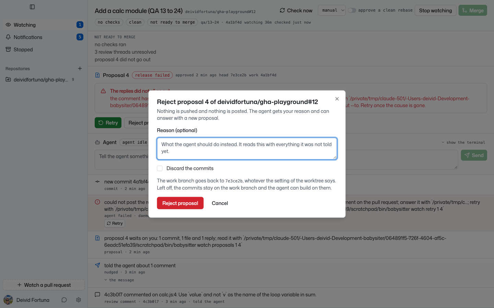
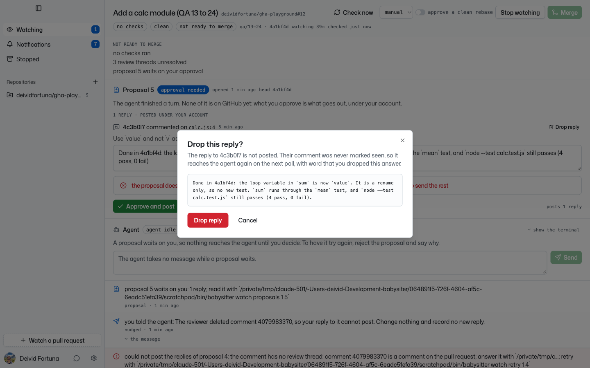
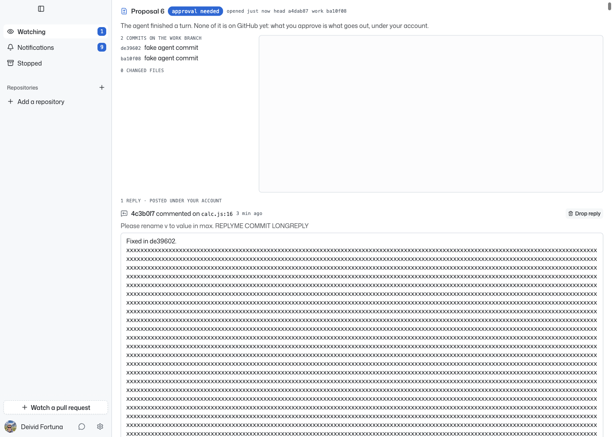

# 25. The app promises a reject it cannot do, and keeps the refusal on the next proposal

**Pending issue 25 of `PENDING_ISSUES.md`.** The page carries the number
of the issue.

**Verdict: confirmed in the app and by a unit test that fails. Found in
the QA check of 17.**

Evidence collected 2026-09-23 at `13f6bfc`, with a new daemon and the
Vite renderer of that commit, driven by Playwright. Watch 1 on
`deividfortuna/gha-playground#12` in `manual`.

## What I did

1. Proposal 4 failed after its push landed: the reviewer deleted the
   comment its reply answered (see 14 and 24).
2. In the app, I clicked `Reject proposal`, checked `Discard the
   commits`, and confirmed.
3. I closed the dialog and sent the agent a message. Its next turn took
   the reply of proposal 4 into proposal 5.

## What I saw

The dialog promised what the daemon then refused:



```
Nothing is pushed and nothing is posted. ...
The work branch goes back to 7e3ce2b, whatever the setting of the worktree says.
```

The daemon answered 409:

```
the proposal does not wait on a decision: part of proposal 4 is on GitHub, its
commits are on qa/13-24; retry it to send the rest
```

When proposal 5 came, its panel still showed that refusal above its
buttons:



## Why

- The reject dialog has one text for every proposal it rejects. For a
  failed proposal, the app does not know whether the push landed.
- The panel shows `approving.error ?? rejectRequest.error` of the
  mutations of the watch, and nothing resets them when the proposal
  changes (`frontend/src/renderer/components/proposal-panel.tsx`).

## The test

`the refusal of a reject does not stay on the next proposal` in
`frontend/src/renderer/components/proposal-panel.test.tsx`:

```
AssertionError: expected <div data-slot="alert-title" …(1)></div> to be null
+ the proposal does not wait on a decision: part of proposal 4 is on GitHub, its
  commits are on feat/retry; retry it to send the rest
```

No test covers the text of the dialog. It needs a decision first: hide
the reject for a failed proposal whose push landed, or have the daemon
say so on the proposal.

## Regression check after the rebase

**Verdict: the stale refusal is fixed. The dialog is open: it still
promises that nothing went out.**

Checked 2026-09-24 at `3c87078`, after the rebase of `test-battery`,
with a daemon built from it and the Vite renderer driven by Playwright.
Watch 1 on `deividfortuna/gha-playground#13` in `manual`. Proposal 5
failed after its push landed (see 14 and 17).

1. In the app, I clicked `Reject proposal`, checked `Discard the
   commits`, and confirmed. The dialog said `Nothing is pushed and
   nothing is posted` and that the work branch goes back to `a4dab87`.
   The daemon refused with the reason of 17.
2. Without a reload of the page, I clicked `Cancel` and sent the agent
   a message. Its next turn took the reply over into proposal 6.

```
alerts before: ["the proposal does not wait on a decision: part of proposal 5 is on GitHub, ..."]
alerts after:  []
```



The same screen shows pending issue 27: proposal 6 starts at `a4dab87`
and lists `de39602`, the head of the pull request, as a commit to push.
