# Auto watch: evidence of the live run

**Verdict: stories 1, 2, 3, 6, 7, 8 and 9 of
`docs/features/auto-watch/prd.md` hold live. The run found three
defects. All three are fixed on the branch. The first two were checked
live again, and the third has a test.**

Evidence collected 2026-09-27 on `worktree-auto-watch-repository-prs`,
on [`deividfortuna/gha-playground`](https://github.com/deividfortuna/gha-playground).
The daemon was built from the branch and ran in isolation: a scratch
data directory and database, port 47811, repository pass every 15 s and
watch poll every 30 s. The renderer was served by Vite with
`?daemon=http://127.0.0.1:47811/api/v1` and driven by Playwright in a
headed Chromium. The agents are Claude Code. The playground has no
branch rule, so the base branch asks for no review.

The repository configuration was set in the app:
- checkout: a clone of the playground;
- **My pull requests** and **Dependabot** on;
- merge scope `minor`, approval `green`, limit 1.

Then a commit on `main` added a `package.json` and a
`.github/dependabot.yml`, and Dependabot opened four pull requests:

| PR | Update | Type |
| --- | --- | --- |
| #20 | the `mixed` group: lodash 4.18.0 to 4.18.1, uuid 8.3.2 to 14.0.2 | patch and major, so major |
| #21 | debug 4.4.0 to 4.4.3 | patch |
| #22 | chalk 4.1.2 to 6.0.0 | major |
| #23 | ms 2.0.0 to 2.1.3 | minor |

## The repository settings panel (R2, R43)

Before a checkout, the three switches are off and disabled.

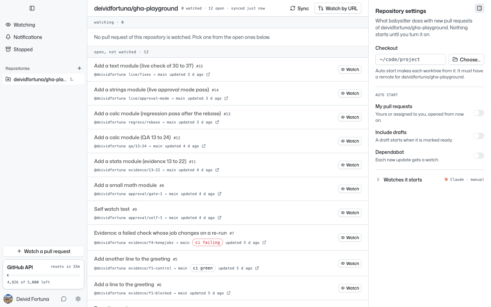

A checkout whose origin is another repository is refused inline, and the
field is marked invalid. The message is the one of the mockup. The first
run showed two defects here, see **Defects** below. This screenshot is
from after the fix.

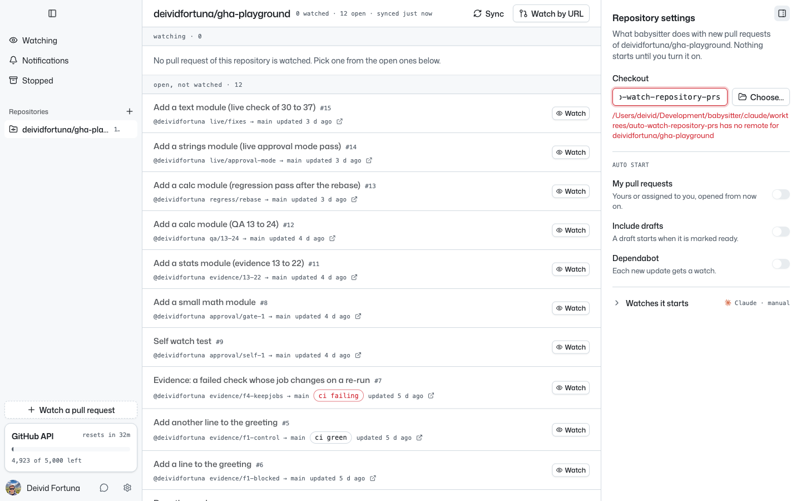

With the checkout of the playground the switches unlock. Each toggle
records when it went on, and the approval text follows the value.

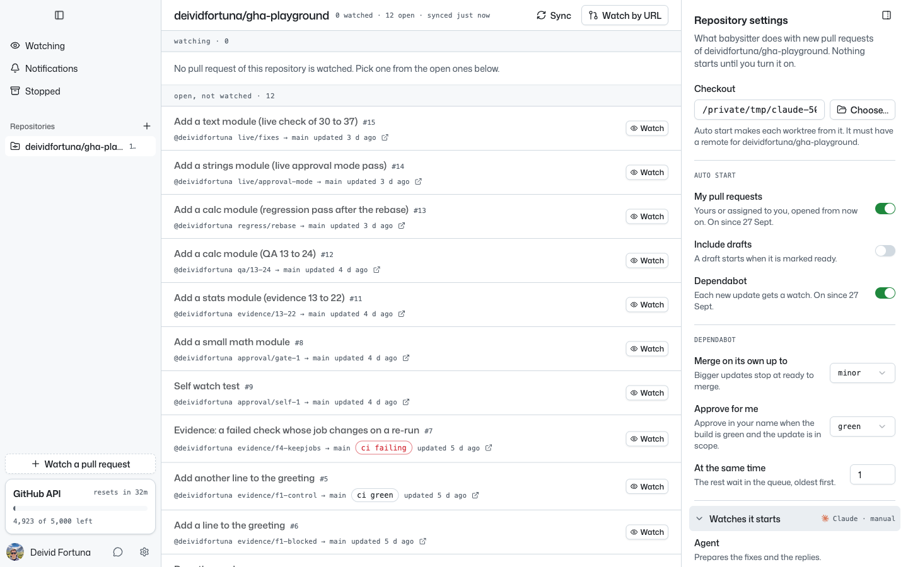

The CLI reads the same configuration, and `repo list` shows the toggles:

```
$ babysitter repo config deividfortuna/gha-playground
Repository:         deividfortuna/gha-playground
Checkout:           …/scratchpad/live/playground
My pull requests:   on since 2026-09-27 12:24
Include drafts:     off
Dependabot:         on since 2026-09-27 12:24
Merge scope:        minor
Approval:           green
At the same time:   1
Watches it starts:  the settings of the daemon

$ babysitter repo list
REPOSITORY                    ADDED       LAST SYNC            AUTO START        ERROR
deividfortuna/gha-playground  2026-09-27  2026-09-27 12:24:44  mine, dependabot
```

## Story 2: a pull request from before the toggle

The playground had 12 open pull requests of the author when the toggle
went on. Many passes later, `GET /watches?status=all` answers
`{"watches":[]}`. None of them started.

## Story 1: the author opens a pull request

The author opened #19. The next pass started a watch on it:

```
auto start began a watch  pr=deividfortuna/gha-playground#19 watch=1 reason=mine
```

The watch has the `auto` badge and an `auto_started` row, "started on
its own: you opened it".

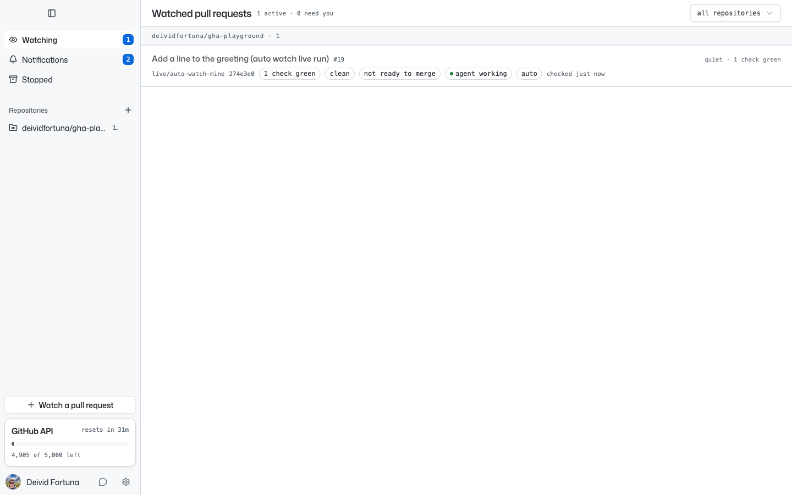

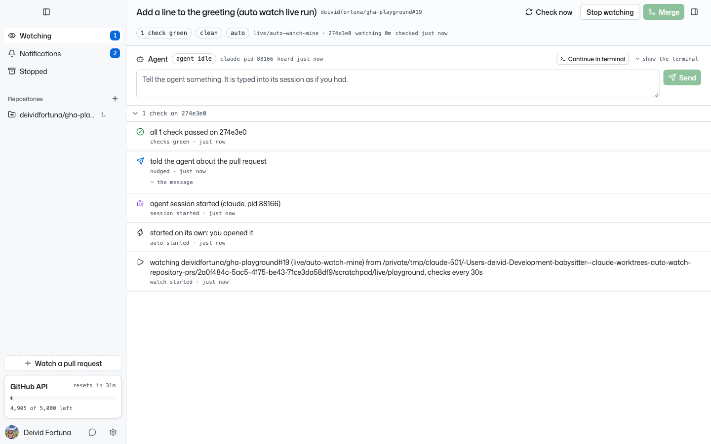

The author got one notification of the kind `auto` and no `watch`
notification for the start.

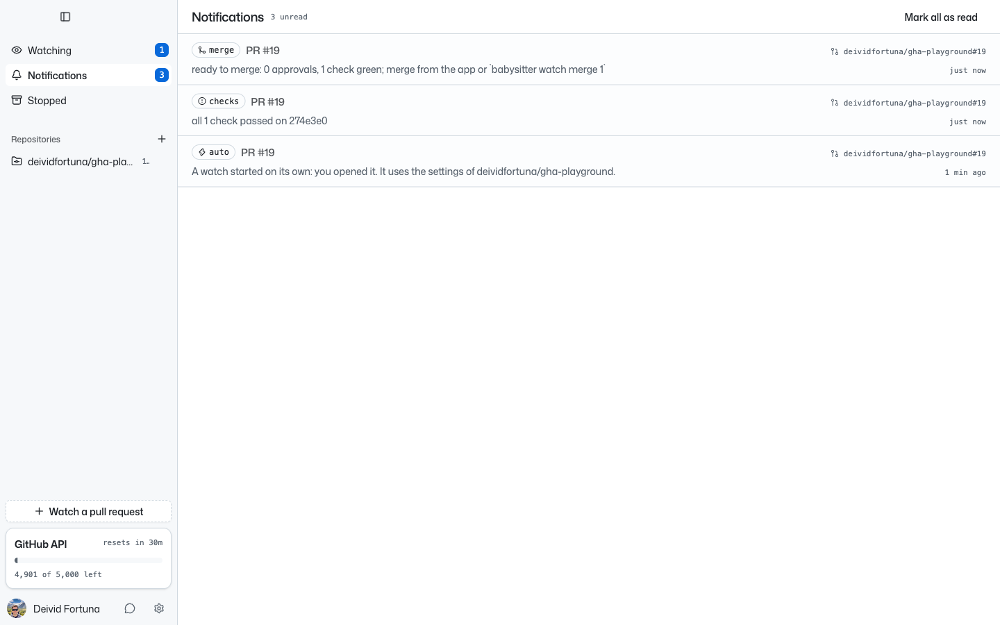

## Story 3: the author stops the watch

The author stopped watch 1 from the app. #19 stays open. Three more
passes started nothing:

```
{"id":1,"number":19,"status":"stopped","stopReason":"user"}
OPEN
```

## Story 6: Monday morning

The four Dependabot pull requests opened within 8 s. With a limit of 1,
the next pass started only the oldest, #20, and the other three wait in
the queue, oldest first. The app shows `queued` and the place of each
one. Each still has its Watch button.

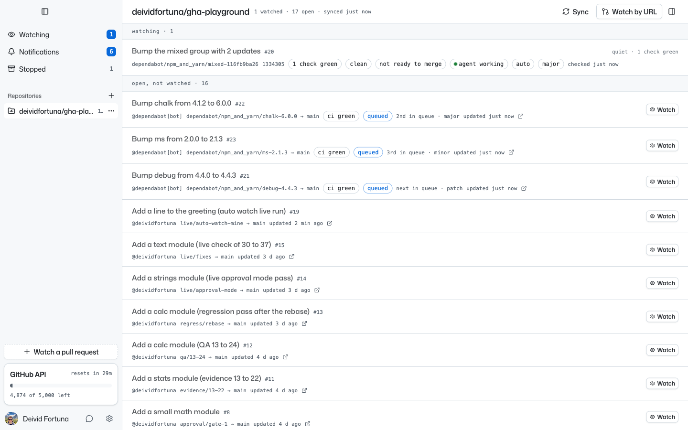

```
$ babysitter repo queue deividfortuna/gha-playground
#  PR  UPDATE  OPENED            TITLE
1  21  patch   2026-09-27 12:26  Bump debug from 4.4.0 to 4.4.3
2  22  major   2026-09-27 12:26  Bump chalk from 4.1.2 to 6.0.0
3  23  minor   2026-09-27 12:26  Bump ms from 2.0.0 to 2.1.3
```

## Story 8: a major waits

#20 holds a patch and a major, so its update type is `major`, outside
the `minor` scope. Merge when ready is off, and `watch status` says
`Auto: started on its own: Dependabot opened it; major update`. The
build went green and the watch stopped at ready to merge. The daemon
submitted no review (`reviews: 0`) and did not merge.

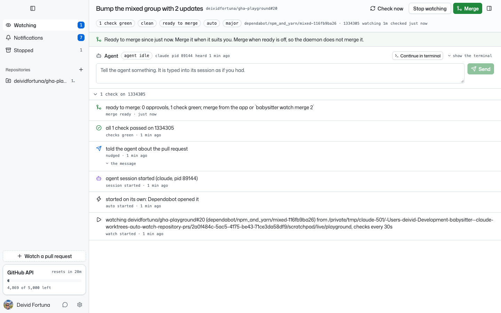

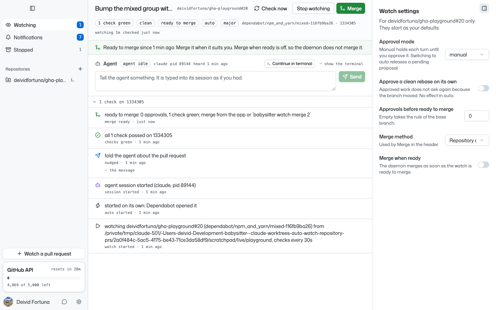

The author then stopped watch 2. That freed the place.

## Story 7: a patch goes out

On the next pass, #21 started, first in the queue, with merge when
ready on because a patch is within the scope. The build was green, so
the policy `green` approved it in the name of the author:

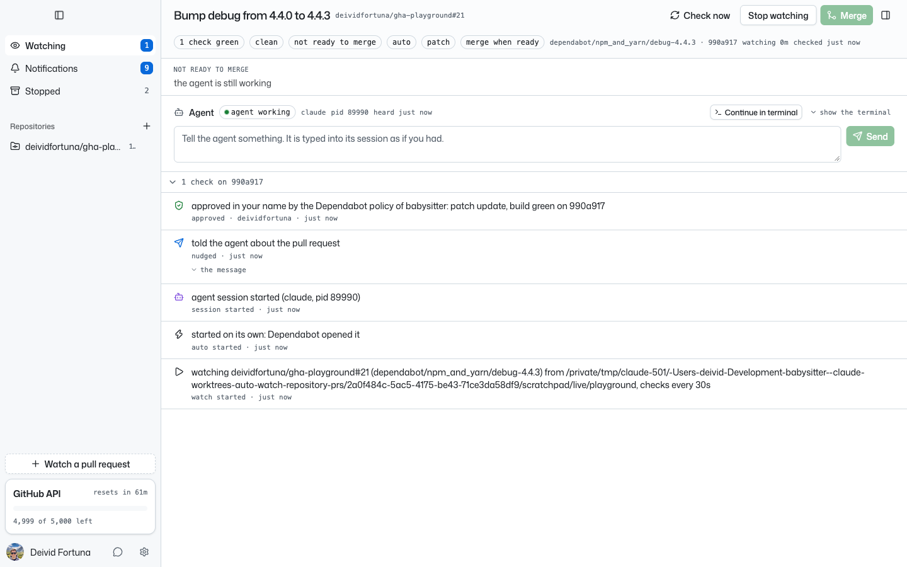

The watch reached ready to merge and the daemon merged it with the
method of the watch. #22, next in the queue, started on the next pass.

```
approved       approved in your name by the Dependabot policy of babysitter: patch update, build green on 990a917
merge_ready    ready to merge: 1 approval, 1 check green; …
merged         merged with squash, as merge when ready asks
watch_stopped  stopped watching (merged): merged at 990a917, checks green; worktree removed
```

On GitHub, #21 is `MERGED` with one review by `deividfortuna`, state
`APPROVED`, body "Approved by the Dependabot policy of babysitter: the
build is green and the update is within the merge scope of the
repository." The merge has a `merge` notification.

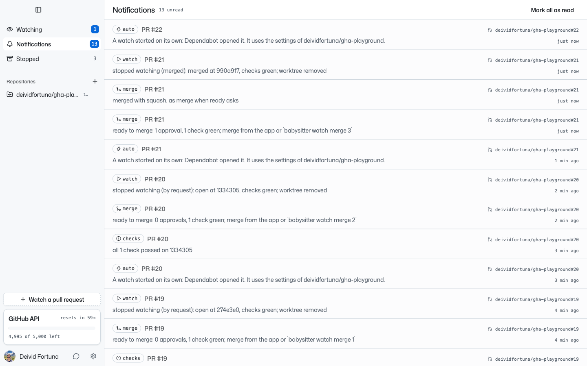

## Story 9: the author approves from the notification

The approval was set to `ask`, and the overrides of the repository were
set to ask for 1 approval, so that a missing review is a blocker.

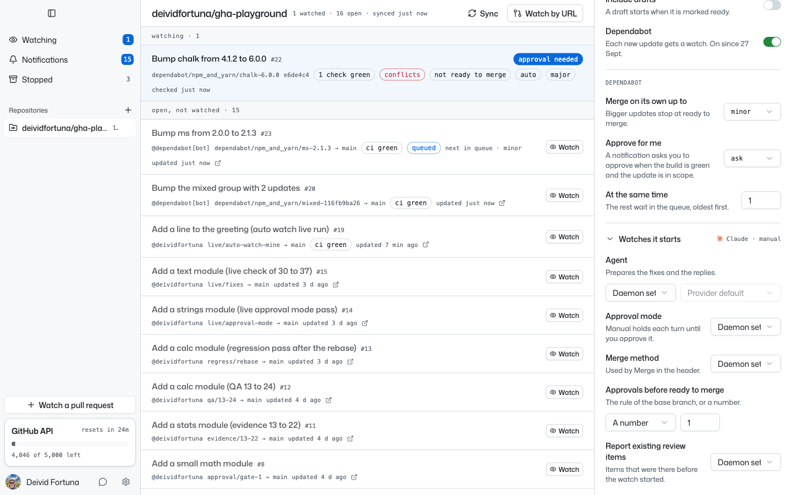

The author stopped #22 (major). #23 (minor) started with 1 approval
required. When its build went green, the daemon recorded
`approval_asked`. Its notification row has **Approve and merge** and
**Open the watch**.

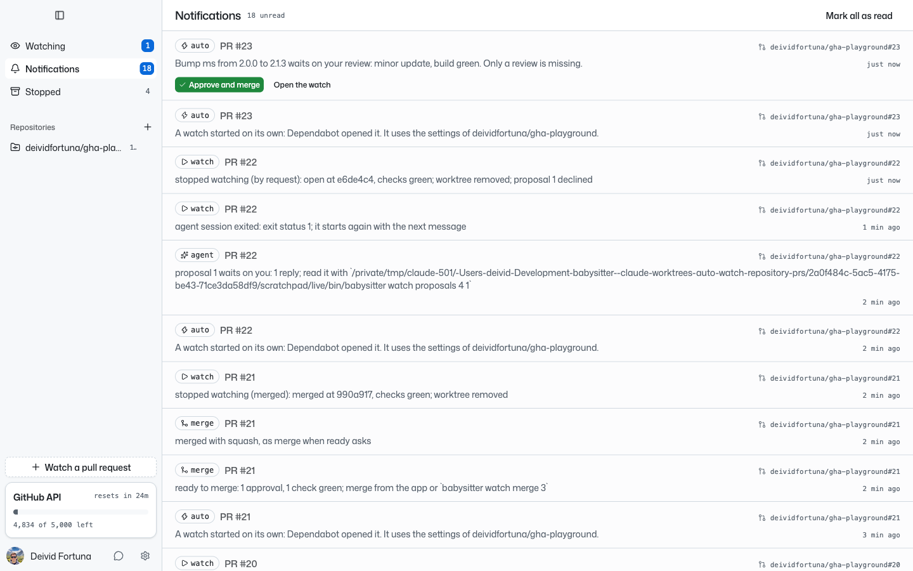

The click approved the pull request in the name of the author. The merge
in the same request answered 409, not ready, and the log does not keep
why. At that moment the agent session was 22 s old, and a new head
from the rebase of Dependabot had just arrived. That is R28: what keeps
a watch from ready keeps it from the merge. Merge when ready was on, so
the daemon merged #23 on its own once it was ready. #23 is `MERGED` with
one approval.

```
approved     approved in your name from babysitter: minor update, build green on d04ed8d
commit       new commit d04ed8d on dependabot/npm_and_yarn/ms-2.1.3
merge_ready  ready to merge: 1 approval, 1 check green; merge when ready merges it now
merged       merged with squash, as merge when ready asks
```

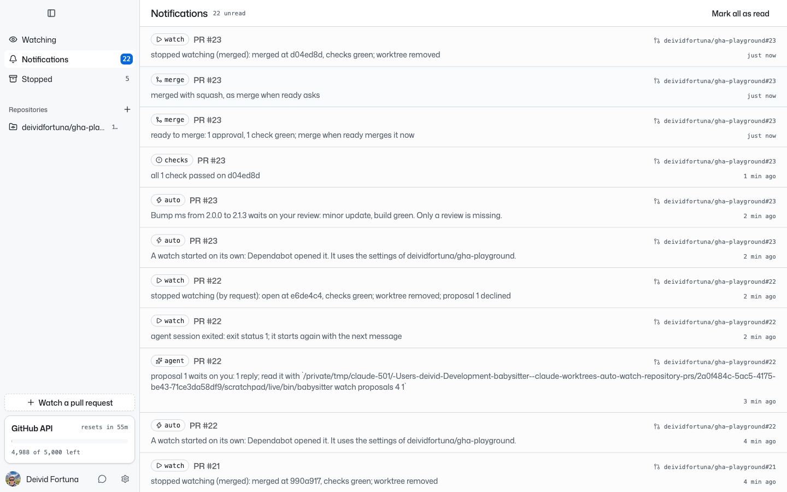

## Defects found in the run

1. **A long checkout path overflowed the panel.** The error under the
   checkout field ran out of the panel. Fixed: the text wraps
   (`repo-settings-panel.tsx`). Checked live again, screenshot 2.
2. **The checkout error started with "invalid checkout:".** The Go
   sentinel was in the message. Fixed: `autostart.CheckCheckout` returns
   the reason alone and still matches `ErrBadCheckout`. Checked live
   again, screenshot 2, and by `TestTheCheckoutMustHaveARemoteForTheRepository`.
3. **`merge_ready` asked the author to merge when merge when ready was
   on.** Fixed: the row says "merge when ready merges it now". Checked
   live on #23, and by `TestAGreenPatchIsApprovedOnceAndMergesOnItsOwn`.

One more change came from story 9. A second **Approve and merge** after a
refused merge would have submitted a second review on the same head.
Fixed: `watch merge --approve` approves once for each head, as the
policy `green` does. Checked by
`TestApproveAndMergeApprovesOnceForEachHeadWhenTheMergeWaits`, not live.

## Not run live

- Story 4 (a draft), story 5 (a fork), story 10 (the toggle goes off),
  story 11 (a merge fails), story 12 (two daemons) and story 13
  (`serve`). Each has a test that fails without the change:
  `TestADraftStartsWhenItIsReady`,
  `TestAPullRequestFromAForkIsSkippedAndLoggedOnce`,
  `TestTheToggleGoesOffTheWatchesGoOnAndTheQueueIsEmpty`,
  `TestAMergeWhenReadyThatFailsTriesOnceForEachHead`,
  `TestTwoDaemonsStartOneWatchAndTheOtherWritesADebugLine` and
  `TestServeStartsNoWatch`.
- The macOS banner. By decision, **Approve and merge** is in the app
  list only.

## What the run left on the playground

- #19 (the pull request of the author) is open.
- #20 and #22 (majors) are open, and their watches are stopped.
- #21 and #23 are merged.
- `main` has the `package.json` and `.github/dependabot.yml` of the run,
  so Dependabot keeps opening update pull requests there.
