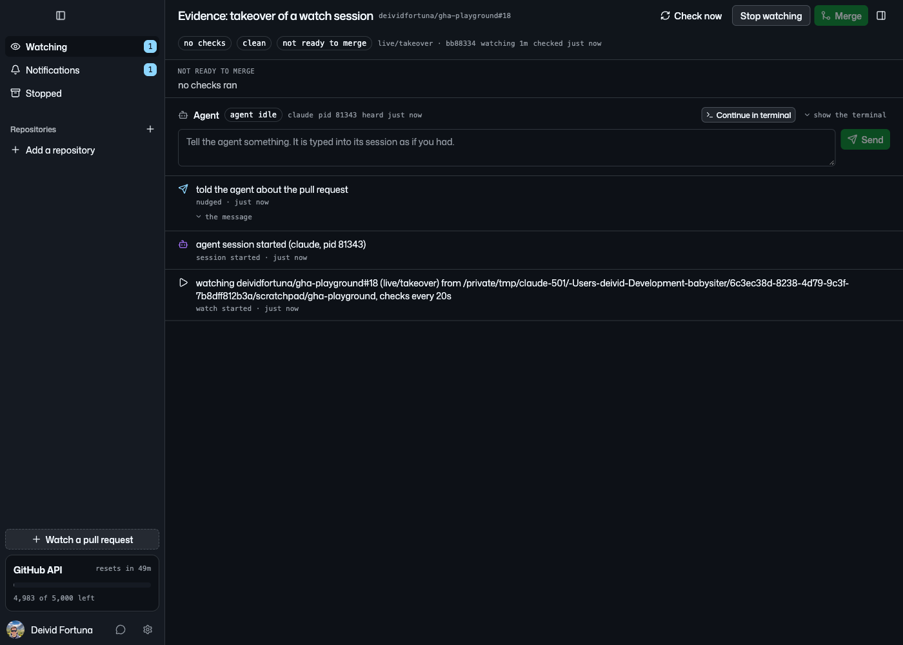
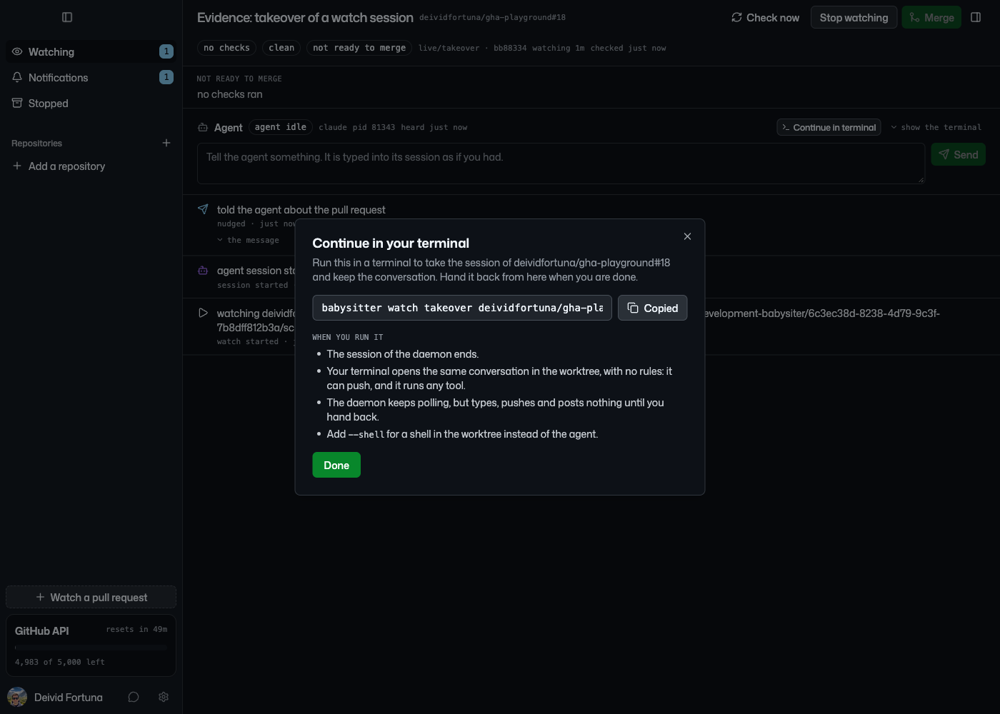
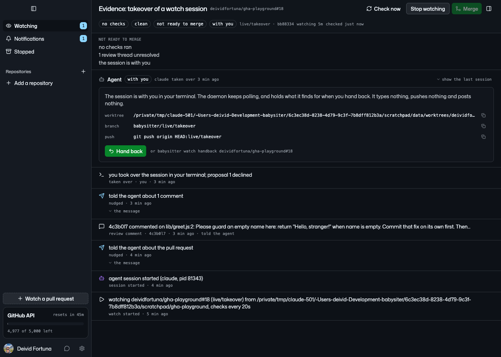
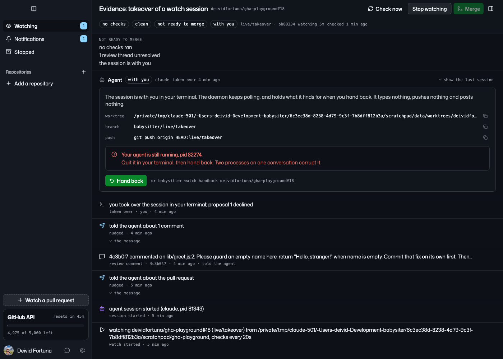
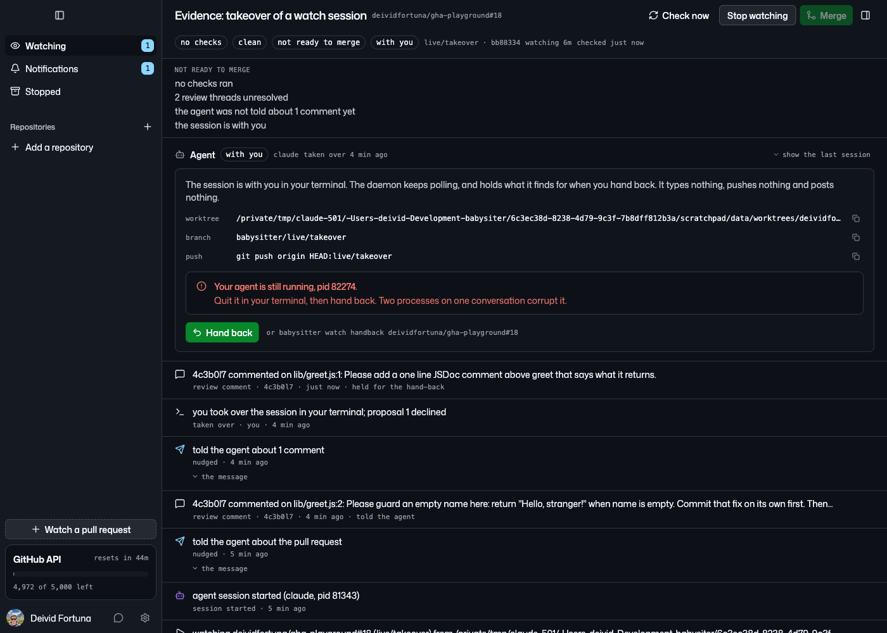
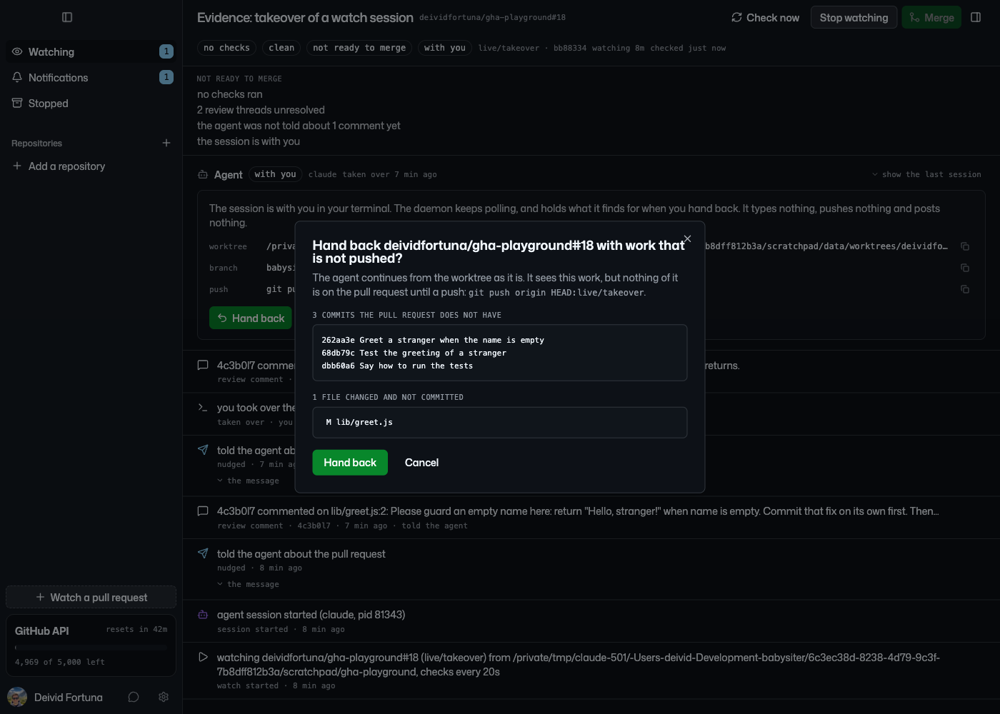
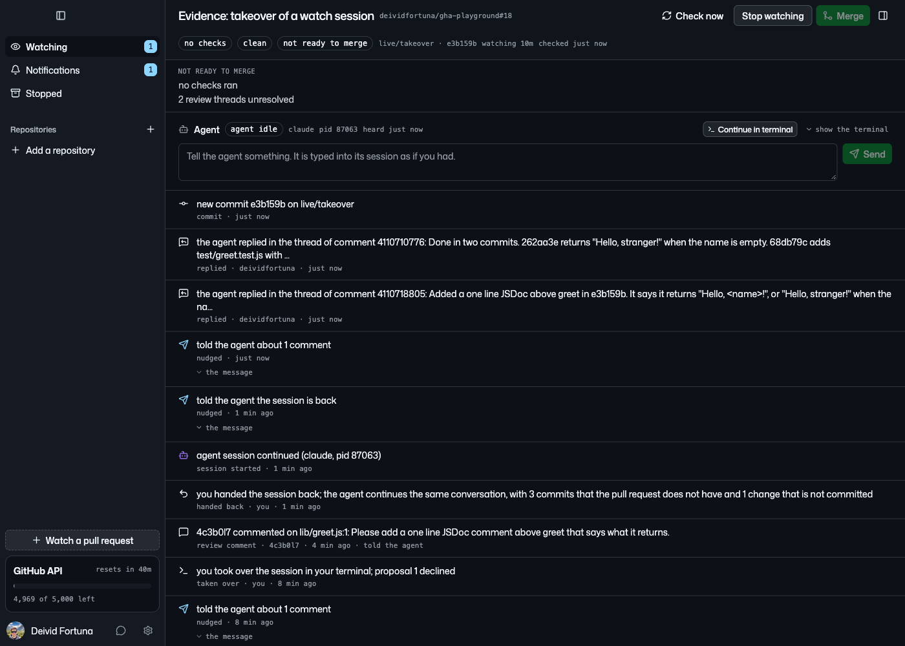
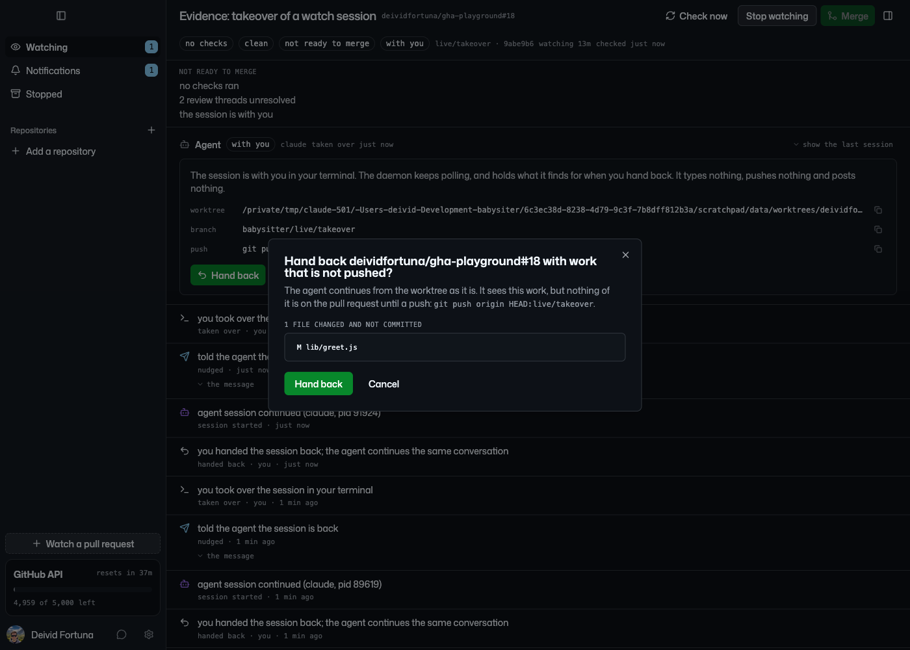

# Takeover: evidence of the live run

**Verdict: stories 1, 2, 4, 7, 8, 9 and 10 of `prd.md` hold live, and
so do R7, R8 and a restart of the daemon while the session is with the
author. The run found two defects. Both are fixed on the branch and
checked live again.**

Evidence collected 2026-09-26 on `feature/takeover`. Watch 1 on
[`deividfortuna/gha-playground#18`](https://github.com/deividfortuna/gha-playground/pull/18),
provider `claude`, approval mode `auto`. Daemon built from the branch
on a scratch data directory, renderer served by Vite and driven by
Playwright, terminals of the author in tmux. The reviewer is `4c3b0l7`.

## Story 10: the app gives the command

The agent section of a watch with a session has "Continue in terminal"
next to the terminal toggle.



The dialog shows the command, and Copy put it on the clipboard:
`babysitter watch takeover deividfortuna/gha-playground#18`.



## Stories 1 and 2: a takeover in the middle of a turn

`4c3b0l7` asked for a fix and a test in two commits. As soon as the
agent made its first commit, the takeover ran in a new terminal:

```
t=12 commit 262aa3edbea7888f744159b86642e9eb3dc9b627 state=active
PROPOSAL  STATUS  WORK  REPLIES    NOTE
1         open    -     0 replies
```

The CLI printed the banner and replaced itself with the agent:

```
The session of deividfortuna/gha-playground#18 is now yours.
  worktree  …/scratchpad/data/worktrees/deividfortuna-gha-playground-18
  branch    babysitter/live/takeover
  push      git push origin HEAD:live/takeover
Give it back with: babysitter watch handback deividfortuna/gha-playground#18
```

- The pty process of the daemon, pid 81343, is gone.
- The process of the author is `claude --resume 33bcbd5d-163f-4500-a0f2-f71c684295c3`,
  with none of the flags of the daemon (R7). Its pid, 82274, is the pid
  in the `taken_over` row: the exec kept the pid of the CLI.
- The terminal shows the same conversation, up to the commit the
  daemon cut short.
- Proposal 1 is `declined`. The remote head stays `bb88334`, and
  nothing was posted on the pull request.
- No `session_exited` row follows the `taken_over` row.

```
Merge:     not ready: no checks ran; 1 review thread unresolved; the session is with you
Agent:     with you since 2026-09-26T08:31:35Z

ID  PULL REQUEST                     BRANCH         PROVIDER  STATUS  AGENT     HEAD     CHECKS
1   deividfortuna/gha-playground#18  live/takeover  claude    active  with you  bb88334  none
```



## Story 8: the agent of the author still runs

```
$ bs handback deividfortuna/gha-playground#18
error: the session is still open in your terminal (pid 82274); quit it first, or pass --force
```



The same holds for `takeover --shell` (R8): the shell starts in the
worktree, and the hand-back names its pid until the shell exits.

```
pwd=…/data/worktrees/deividfortuna-gha-playground-18 shell pid=90892
error: the session is still open in your terminal (pid 90892); quit it first, or pass --force
```

## Story 4: a review while the author has the session

`4c3b0l7` wrote a second comment. The poll recorded it and told nobody:

```
7   2026-09-26 20:35  review_comment   4c3b0l7 commented on lib/greet.js:1: Please add a one line JSDoc …
{"kind":"review_comment","nudgedAt":null}
```

No session of the daemon started. The daemon was built again and
restarted while the watch was taken over, and it started no session
either:

```
level=INFO msg="the session is with you, the message waits for the hand-back" component=prwatch watch=1
```



## Story 7: a hand-back with work that is not pushed

After the author quit the agent, they committed the staged test, made
a second commit, and left one file changed:

```
$ bs handback deividfortuna/gha-playground#18
3 commits the pull request does not have:
  262aa3e Greet a stranger when the name is empty
  68db79c Test the greeting of a stranger
  dbb60a6 Say how to run the tests
1 file changed and not committed:
   M lib/greet.js
Hand back with this work? [y/N] n
error: the session stays with you; pass --yes to hand back with this work
```

The Hand back button of the app opened the same list:



## Story 9: the agent continues

Hand back in the dialog. The daemon resumed the same conversation with
its own rules, told the agent what the author did, then gave it the
comment that waited:

```
87063 claude --resume 33bcbd5d-163f-4500-a0f2-f71c684295c3 --permission-mode dontAsk --setting-sources user …
8   handed_back      you handed the session back; … with 3 commits that the pull request does not have and 1 change that is not committed
9   session_started  agent session continued (claude, pid 87063)
10  nudged           told the agent the session is back
11  nudged           told the agent about 1 comment
12  replied          the agent replied in the thread of comment 4110718805: Added a one line JSDoc above greet in e3b159b …
13  replied          the agent replied in the thread of comment 4110710776: Done in two commits. …
14  commit           new commit e3b159b on live/takeover
```

The first turn after the hand-back pushed the commits of the author
with its own commit, in one push:

```
e3b159b Say what greet returns
dbb60a6 Say how to run the tests
68db79c Test the greeting of a stranger
262aa3e Greet a stranger when the name is empty
bb88334 Add a greet function
```



## Defects found in the run

### The session of the author refused tools

A resume keeps the permission mode of the conversation. The daemon runs
its session in `dontAsk`, so the session of the author showed
`don't ask on` and refused a commit:

```
❯ Commit the staged test/greet.test.js with the message: Test the greeting of a stranger. Do nothing else.
⏺ I couldn't make the commit: the session is in don't-ask mode, and that mode denied the git commit command.
```

The fix passes `--permission-mode manual` in the command of the author
(`TestTheCommandOfTheAuthorContinuesTheConversationWithNoRules`). With
the daemon built again, a second takeover ran
`claude --resume 33bcbd5d-163f-4500-a0f2-f71c684295c3 --permission-mode manual`,
showed `manual mode on`, and asked before the commit:

```
 Bash command
   │ git commit -q -m "Note to trim the name" -- lib/greet.js && git log --oneline -1 && git status --short
 This command requires approval
 Do you want to proceed?
 ❯ 1. Yes
```

After the approval, the push command of the banner pushed from that
session, because the `pre-push` hook of the daemon is not in it:

```
9abe9b6695a07485b12b3de701d3c5526409bc2b	refs/heads/live/takeover
```

A clean worktree then handed back at once, with no question.

### The title of the hand-back dialog ran under the close button

The screenshot of story 7 shows the long title under the ✕. The header
now keeps room for it:



## Not run live

- Story 3, a `pending` proposal, and story 5, a Copilot hook: the tests
  `TestATakeoverDeclinesThePendingProposal` and
  `TestAHookOfTheSessionOfTheAuthorChangesNothing` cover them.
- Story 6, a merge while the author has the session:
  `TestAMergeWhileTheAuthorHasTheSessionKeepsTheWorktree` covers it.
- The Copilot provider: `copilot --help` says `--resume <id>` continues
  a session, but no Copilot session ran.
